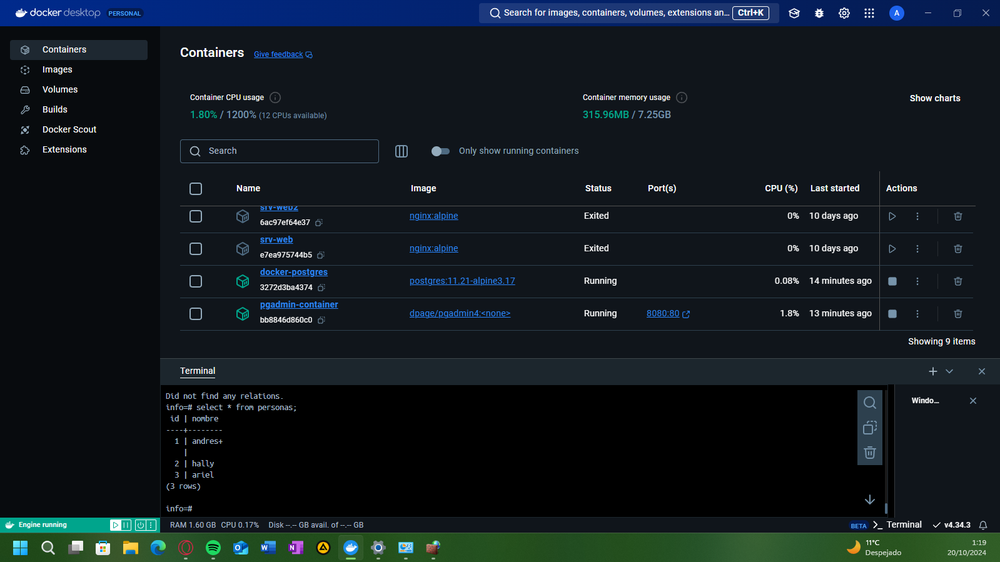

### Crear contenedor de Postgres sin que exponga los puertos. Usar la imagen: postgres:11.21-alpine3.17
# docker network create postgres-network
# docker run -d  --name docker-postgres  --network postgres-network -e POSTGRES_PASSWORD=P@ssw0rd postgres:11.21-alpine3.17

### Crear un cliente de postgres. Usar la imagen: dpage/pgadmin4

# docker run -d  --name pgadmin-container --network postgres-network -e PGADMIN_DEFAULT_EMAIL=pgadmin@postgres.com -e PGADMIN_DEFAULT_PASSWORD=P@ssw0rd -p 8080:80 dpage/pgadmin4

La figura presenta el esquema creado en donde los puertos son:
- a: 8080
- b: 80
- c: 5432

## Desde el cliente
### Acceder desde el cliente al servidor postgres creado.
# COMPLETAR CON UNA CAPTURA DEL LOGIN

### Crear la base de datos info, y dentro de esa base la tabla personas, con id (serial) y nombre (varchar), agregar un par de registros en la tabla, obligatorio incluir su nombre.

## Desde el servidor postgresl
### Acceder al servidor
### Conectarse a la base de datos info
# docker exec -it docker-postgres psql -U postgres
# \c info
# select * from personas
### Realizar un select *from personas
# AGREGAR UNA CAPTURA DE PANTALLA DEL RESULTADO

